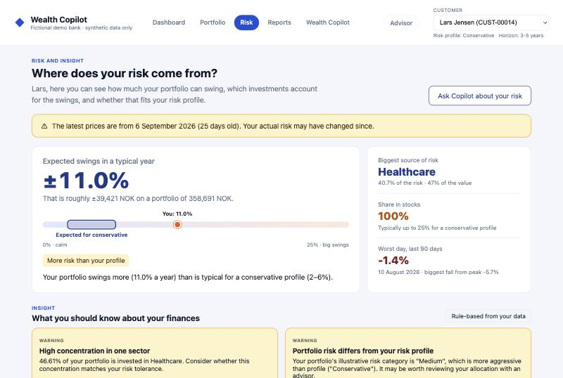
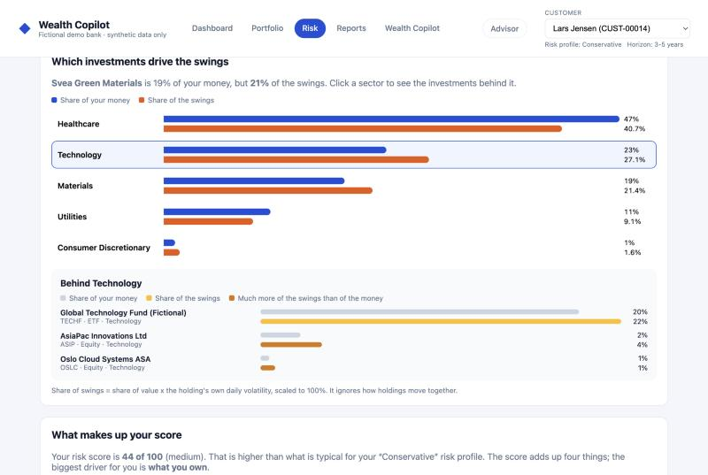
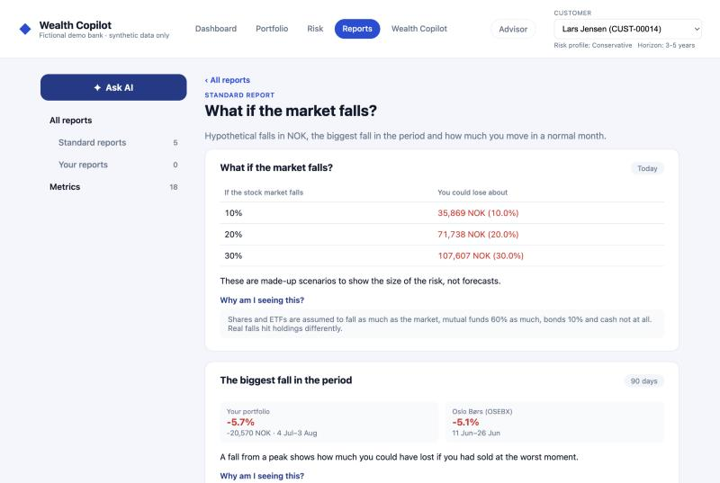
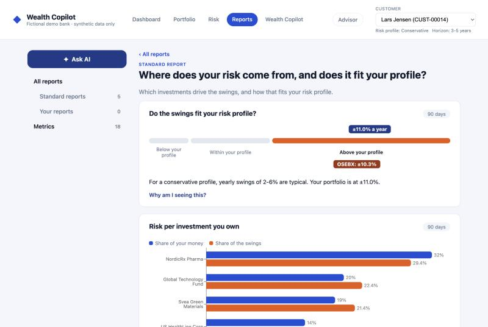
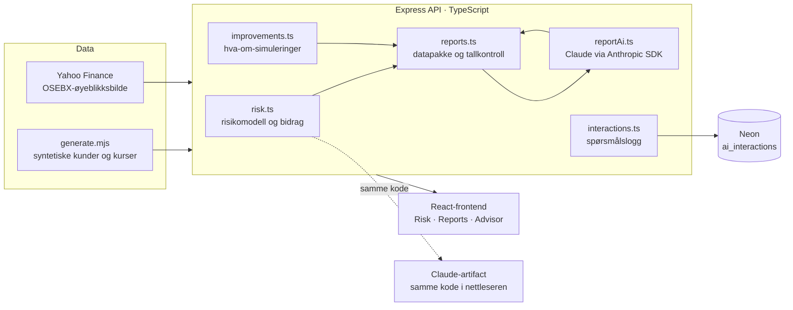

# Wealth Copilot: forklarbar porteføljerisiko

En prototype på en nettbank for private banking som forklarer **hvor risikoen i en
investeringsportefølje kommer fra**, i et språk kunden forstår. I stedet for én risikoscore
viser appen hvor mye porteføljen kan svinge i kroner, hvilke investeringer og sektorer som
står for svingningene, hvordan det passer kundens risikoprofil, og hva som skjer hvis
markedet faller. Kunden kan også be om egne rapporter som skrives av Claude, men som alltid
bygger på beregnede tall fra kundens egne data.

Prosjektet er laget som et gruppearbeid i en workshop om data- og AI-plattformer for
kapital- og formuesforvaltning (se [Bakgrunn](#bakgrunn)).

**Alle kunder, beholdninger og kurser er syntetiske. Dette er en pedagogisk demo, ikke et
bank- eller investeringsprodukt, og ingenting her er investeringsråd.**



## Problemet

Workshopens kundecase handler om Jonas (36). Han oppfatter seg som en moderat investor, men
porteføljen har gradvis fått mer teknologi og globale aksjefond. Når markedet faller, blir
han overrasket over svingningene. Han vil vite:

1. **Hvor kommer risikoen fra?**
2. **Hvilke investeringer bidrar mest?**
3. **Passer porteføljen fortsatt målene og profilen min?**

En risikoscore på «44 av 100» svarer ikke på noen av dem. Målet var derfor å bryte risikoen
ned i faktorer som hver kan forklares med én setning, ett tall og én figur.

## Risikofaktorene og hvordan de forklares

Hver faktor beregnes deterministisk i API-et og vises med et tall kunden kan forholde seg til,
en figur og en forklaring under **«Why am I seeing this?»** som sier hvordan tallet er regnet
ut og hvilke antakelser det bygger på.

| Faktor | Spørsmålet kunden har | Hvordan det beregnes | Hvordan det vises |
| --- | --- | --- | --- |
| **Svingninger mot profilen** | «Er dette normalt for meg?» | Standardavviket til porteføljens daglige endringer, skalert til ett år, sammenlignet med et typisk område per risikoprofil | «±11,0 % i et typisk år, omtrent ±39 000 kr», på en skala med profilens område markert og et merke: over, innenfor eller under profilen |
| **Risikobidrag per investering og sektor** | «Hvor kommer risikoen fra?» | Hver investerings andel av verdien × dens egen volatilitet, skalert til 100 %, og summert per sektor | To stolper per sektor: andel av pengene og andel av svingningene. Klikk på en sektor for å se investeringene bak |
| **Konsentrasjon** | «Hvor store enkeltveddemål har jeg?» | Herfindahl-indeks over beholdningene; den inverse gir et «effektivt antall» like store investeringer | «Du eier 9 investeringer, men porteføljen oppfører seg som om du eide 5», og et trekart der store bokser er store veddemål |
| **Geografi og sektor** | «Hvor i verden er pengene?» | Andel per region og sektor, og Herfindahl-indeks per region | Rangerte stolper og «effektivt antall regioner» |
| **Aktivatype** | «Hva slags ting eier jeg?» | Fast risikovekt per aktivatype (kontanter 2, obligasjoner 20, fond 45, ETF 55, aksjer 80) | Stolpe sortert fra rolig til svingete, og andel i aksjer mot det som er typisk for profilen |
| **Fall og stresstest** | «Hva om markedet faller?» | Største fall fra topp i perioden, verste enkeltdag, og hypotetiske fall på 10, 20 og 30 % med ulik følsomhet per aktivatype | Tap i kroner per scenario, største fall for porteføljen og for Oslo Børs, beste og verste dag |
| **Risiko over tid** | «Hvorfor har risikoen endret seg?» | Risikoscoren regnet ut for hver dag med dagens beholdning, så endringer bare skyldes kursbevegelser | Kurve over 0–100 med risikobåndene, og «Teknologi gikk fra 55 % til 57 % av porteføljen, bare fordi kursene endret seg» |
| **Sammenligning med markedet** | «Er dette mye?» | Ekte sluttkurser for OSEBX, normert til porteføljens startverdi | Porteføljen og OSEBX i samme graf, med svingninger og fall for begge |
| **Samlet risikoscore** | «Hva betyr scoren?» | Vektet sum: aktivatype 40 %, konsentrasjon 25 %, geografi 15 %, volatilitet 20 % | Scoren brutt ned i poeng per faktor, og hva som driver den mest |



### Fra forklaring til handling, uten å gi råd

Siden viser **hva-om-simuleringer** i stedet for anbefalinger. Hver regel endrer én ting i
en tenkt portefølje og regner ut risikoen på nytt med samme modell:

- **Følge profilen:** den minste flyttingen, i steg på 10 %, som får porteføljen i tråd med risikoprofilen.
- **Mindre avhengighet av én investering eller sektor:** flytte overskuddet til en generell, bred plassholder.

Hver simulering viser score før og etter, hvilke faktorer som endres og hva kunden gir opp.
Simuleringene navngir aldri konkrete produkter, og ingen av dem øker risikoen i det skjulte.
Det er sjekket for alle de 100 kundene.

## Prinsipper

- **Forklar, ikke anbefal.** Teksten beskriver hva tallene betyr. Råd om kjøp og salg overlates til rådgiveren.
- **Fakta beregnes, AI forklarer.** Alle tall kommer fra deterministiske beregninger i API-et. Språkmodellen formulerer svaret, men finner ikke på tall.
- **Vis grunnlaget.** Hvert kort har «Why am I seeing this?» med metode og antakelser, og siden varsler når prisene er gamle («De siste prisene er 25 dager gamle»).
- **Vær ærlig om begrensningene.** Antakelser som typiske svingninger per profil og markedsfølsomhet er synlige i grensesnittet, ikke gjemt i koden.
- **Kunden får vite hva som deles.** Spørsmål til AI-en lagres og deles med rådgiveren, og det står der kunden stiller spørsmålet.

## AI-rapporter med Claude



Rapportsiden har fem standardrapporter som bygges av faste kort og åpnes uten AI-kall. Den har også
**«Ask AI»**, der kunden skriver et spørsmål som «Hvordan har de asiatiske aksjene mine gjort det?».

1. **Datapakke:** API-et bygger en deterministisk pakke med kundens tall: beholdninger, avkastning per investering, region og sektor, risiko og risikobidrag. Navn og inntekt er fjernet.
2. **Strukturert svar:** Claude får datapakken og regler om å bruke bare disse tallene, skille fakta fra forklaring, ikke gi råd og svare på kundens språk. Svaret må følge et JSON-skjema.
3. **Kortvalg:** Claude velger også opptil fire kort fra biblioteket på 18 kort som illustrerer svaret. Ukjente kort forkastes.
4. **Tallkontroll:** Hvert nøkkeltall i svaret sjekkes mot tallene i datapakken og merkes «fra dataene» eller «ikke funnet – sjekk selv».
5. **Reserve:** Mangler API-nøkkelen, avslår modellen eller feiler kallet, vises en deterministisk standardrapport med en forklaring.



Appen kan også bygges som et **Claude-artifact** uten server. Da kjører beregningene i
nettleseren, og rapportene skrives via artifactets innebygde tilgang til Claude på seerens
egen konto.

## Rådgiversiden

Alle spørsmål kunden stiller AI-en, både i rapporter og i Copilot, lagres i **Neon
(PostgreSQL)** sammen med svaret. Hvert spørsmål merkes automatisk med emner (`markedsfall`,
`profil-match`, `geografi` …) og flagg som `ønsker_råd` («Bør jeg selge …?»), `bekymring`
(«jeg ble skremt») og `mangler_data` (bitcoin i en annen bank).

Private bankeren logger inn med passord og ser hvilke kunder som har spurt om hva, hvem som
vil ha råd eller er bekymret, og kan merke spørsmål som gjennomgått og skrive notater.
Passordet sjekkes på serveren, og innlogging gir en signert sesjon med utløpstid og
begrensning på antall forsøk.

## Arkitektur



| Del | Teknologi |
| --- | --- |
| Frontend | React 18, TypeScript, Vite, Recharts |
| API | Node.js, Express, TypeScript, OpenAPI/Swagger |
| AI | Claude (`claude-opus-5-5`) via Anthropic SDK med strukturert JSON-svar, eller artifactets `sample` |
| Database | Neon (serverless PostgreSQL) for spørsmålsloggen |
| Kvalitet | Vitest og Supertest: 110 tester (69 API, 41 frontend), typesjekk i begge arbeidsområder |

## Kom i gang

Krav: Node.js 18 eller nyere.

```bash
npm install
npm run generate-data
npm run dev
```

Frontend kjører på `http://localhost:5173`, og API-et på `http://localhost:3000`
(Swagger på `/docs`).

Valgfritt: kopier `api/.env.example` til `api/.env` og fyll inn:

| Variabel | Gir |
| --- | --- |
| `ANTHROPIC_API_KEY` | AI-rapporter skrevet av Claude (ellers standardrapporter) |
| `DATABASE_URL` | Spørsmålslogg i Neon/PostgreSQL (ellers bare i minnet) |
| `ADVISOR_PASSWORD` | Tilgang til rådgiversiden (ellers stengt) |

`api/.env` er ignorert av git. Legg aldri nøkler eller passord i koden.

### Nyttige kommandoer

```bash
npm test                                   # Alle tester for API og frontend
npm run lint                               # Typesjekk begge arbeidsområdene
npm run build                              # Produksjonsbygg av API og frontend
npm run generate-data                      # Lag de syntetiske datasettene på nytt (seedet, reproduserbart)
npm run fetch-benchmark                    # Hent nye OSEBX-kurser fra Yahoo Finance
npm run build:artifact --workspace frontend # Bygg appen som én HTML-fil for et Claude-artifact
```

## Prosjektstruktur

```text
api/src/
  routes/              REST-endepunkter (kunder, rapporter, Copilot, rådgiver)
  services/
    risk.ts            risikomodell, risiko over tid og risikobidrag per investering
    improvements.ts    hva-om-simuleringer
    reports.ts         datapakke, kortkatalog og tallkontroll for rapporter
    reportPrompt.ts    regler, JSON-skjema og validering av AI-svar
    reportAi.ts        Claude-rapporter med reserve til standardrapporter
    interactions.ts    spørsmålslogg i Neon, med emner og flagg
    advisorAuth.ts     passordinnlogging for rådgiversiden
frontend/src/
  pages/               Dashboard, Portefølje, Risk, Copilot, Advisor
  reports/             rapportsider og biblioteket med 18 kort
  components/          figurer for risiko, fordeling og utvikling
  utils/               rene beregninger (svingninger, fall, stresstest) med tester
  artifact/            nettleserversjon av API-klienten for artifact-bygget
data/                  datagenerator, syntetiske datasett og OSEBX-øyeblikksbilde
docs/                  workshopoppgave, datamodeller og skjermbilder
```

API-endepunktene er dokumentert i Swagger (`/docs`) og i `api/src/openapi.yaml`.
Datamodellene er beskrevet i [docs/datamodeller.md](docs/datamodeller.md).

## Begrensninger

Dette er en prototype, og noen forenklinger er bevisste:

- **Syntetiske data:** Kunder, beholdninger og kurser er generert, med omtrent 90 dager kurshistorikk. Bare OSEBX er ekte.
- **Ingen kjøpshistorikk:** Historikken antar at dagens beholdning var den samme hele perioden.
- **Forenklet risikomodell:** Risikoscoren er laget for undervisning, ikke for å vurdere egnethet. Den ser bort fra samvariasjon mellom investeringer, og fond regnes som én investering selv om de i praksis er spredt.
- **Antakelser:** Typiske svingninger per profil, maks aksjeandel og markedsfølsomhet er illustrative. De vises i grensesnittet.
- **Enkel innlogging:** Rådgiversiden bruker ett delt passord. En ekte løsning trenger individuelle kontoer, tilgang bare til egne kunder og logging av innsyn.
- **Bare engelsk:** Grensesnittet er på engelsk.

## Bakgrunn

Prosjektet er et gruppearbeid fra en workshop om data- og AI-plattformer for kapital- og
formuesforvaltning. Vi bygde videre på startpakken fra workshopen,
[espkar/wealth-copilot-workshop](https://github.com/espkar/wealth-copilot-workshop), som ga
de syntetiske dataene, et grunnleggende API og en enkel frontend. Workshopoppgaven står i
[docs/workshop.md](docs/workshop.md). Gruppen valgte case B, *Gjør investeringsrisiko synlig
og forståelig*.

Gruppen besto av:

- Trym Bårdsen
- Thomas Strønstad-Løseth
- William Solsvik
- Jørgen Knutsvik
- Harald Kryvi

Videreutviklingen er gjort med Claude Code som parprogrammerer:

- risikomodellen og risikobidrag per investering
- ulik volatilitet per instrument og OSEBX-sammenligning
- Risk-siden, rapportsiden og metrikkbiblioteket
- AI-rapporter med tallkontroll
- spørsmålslogg i Neon og rådgiverside
- artifact-bygget
